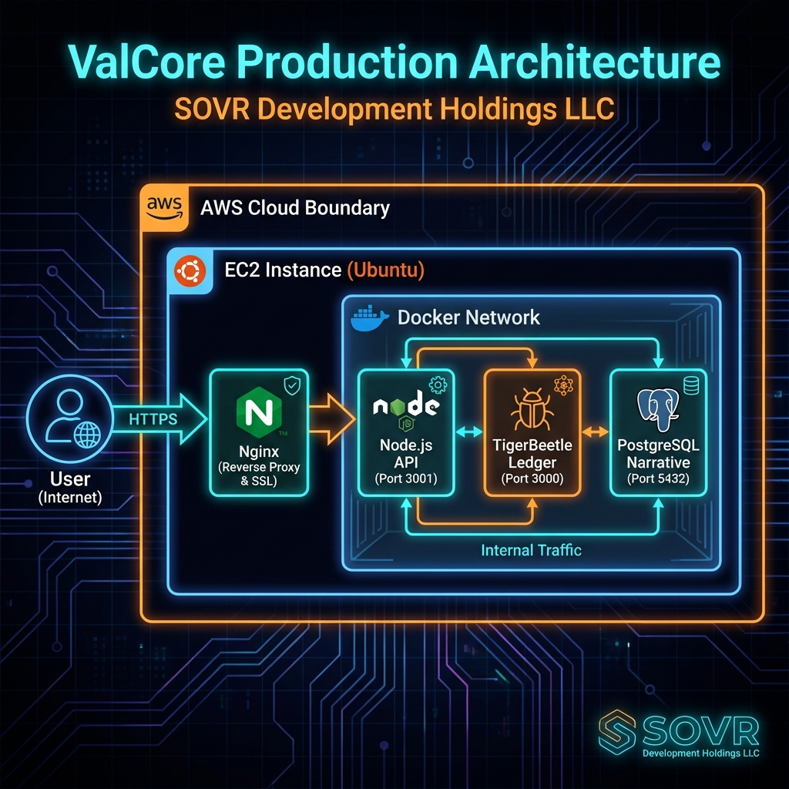

# ValCore System Architecture

## Production Infrastructure (AWS)

The following diagram illustrates the current "live" deployment architecture on AWS (`sovr.credit`).

## Component Flow

1.  **User Access**: Encrypted traffic (HTTPS) enters via `sovr.credit` (resolved by Namecheap DNS to AWS Elastic IP).
2.  **EC2 Instance (Ubuntu)**: The host machine managing the containerized environment.
3.  **Nginx (Reverse Proxy)**:
    - Terminates SSL (Let's Encrypt).
    - Serves static frontend assets (React/Vite).
    - Proxies API requests (`/api/*`) to the backend container.
4.  **Docker Container Network**: An isolated bridge network containing the core services.
    - **Node.js API (`sovr_backend`)**: The central logic handler. It validates requests, manages auth, and orchestrates transactions.
    - **TigerBeetle (`sovr_tigerbeetle`)**: The immutable ledger for financial mechanics ("Mechanical Truth").
    - **PostgreSQL (`sovr_postgres`)**: The relational database for user data and transaction narratives ("Narrative Mirror").
