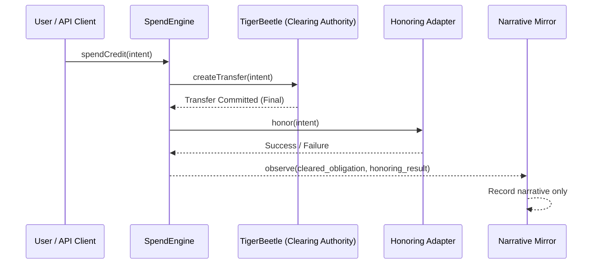

# SOVR Clearing Protocol — VAL Core

<div align="center">
  
</div>

## Sovereign Value Attestation Layer for the GM Family Trust

**VAL Core** is a **ledger-cleared obligation protocol** where value exists only as the result of finalized mechanical transfers. It implements strict sFIAT funding discipline, a mechanically-enforced authority model, and cryptographic integrity monitoring.

This is not a fintech application. It is a protocol for clearing reality itself.

---

## Canonical Authority Model (LOCKED)

The SOVR protocol enforces a non-negotiable authority hierarchy. Truth is mechanical, not narrative.

1.  **TigerBeetle (`val/clearing/tigerbeetle`)** — The **sole mechanical clearing authority**. All obligations are cleared here first, or they do not exist. Its state is immutable and final.

2.  **Backend (`val/core`)** — The **authority gateway**. Orchestrates the clearing flow but holds no authority itself. Translates user intent into ledger commands.

3.  **Honoring Adapters (`val/adapters`)** — **Downstream guests**. Optional external agents (Stripe, Instacart, etc.) that may act upon *already cleared* obligations. They have no authority to approve, deny, or reverse clearing.

4.  **Narrative Mirror (`val/core/narrative-mirror-service.ts`)** — A **read-only observer**. It records the results of cleared transactions for auditing and human-readable logs. It has zero authority and is never consulted for balance checks or clearing decisions.

---

## Execution Flow (Enforced)

The protocol mandates a "clearing-before-honoring" execution sequence. This is not a guideline; it is mechanically enforced by the `spendCredit` function.



### Key Guarantees:
*   **Clearing is Atomic and Final:** The `createTransfer` call to TigerBeetle is the single, authoritative event.
*   **Honoring is Non-Authoritative:** Honoring adapters can fail without affecting the ledger's state. Failures create new obligations, never rollbacks.
*   **Narrative is Never on the Critical Path:** The narrative mirror is a passive listener. Its failure cannot block clearing.

---

## Protocol Hardening & Governance

The SOVR authority model is protected against future regressions through several layers of enforcement.

### 1. Structural Isolation
The TigerBeetle clearing authority is physically isolated in the `val/clearing/tigerbeetle/` directory. This makes it structurally impossible for core business logic to accidentally bypass or misuse the clearing mechanism.

See the authority contract at [`val/clearing/tigerbeetle/README.md`](val/clearing/tigerbeetle/README.md).

### 2. Governance Lock
The core principles of the authority model are constitutionally locked in the `.val/LOCKED_AUTHORITY.md` file. Any change that violates these rules is considered an automatic audit failure. This file serves as a permanent tripwire for all future development.

### 3. "No Reversals" Doctrine
The protocol strictly forbids reversals, rollbacks, or refunds. All failures or adjustments are handled by creating **new obligations** on the ledger. This is enforced in the `spendCredit` function, where a failure in the honoring stage results in a `HONORING_FAILED` event, not a reversal of the cleared transaction.

---

## Technology Stack

-   **Frontend**: React 18 + TypeScript + Vite
-   **Backend**: Node.js + Express + tsx
-   **Clearing Authority**: TigerBeetle
-   **Narrative Mirror**: In-memory (for demo), PostgreSQL (production)
-   **Cryptography**: ethers.js v6

---

## Getting Started

### Prerequisites

-   Node.js 18+
-   npm or yarn
-   A running TigerBeetle cluster

### Installation

```bash
# Clone the repository
git clone https://github.com/sovr-holdings/gm-family-trust-val-core.git
cd gm-family-trust-val-core

# Install dependencies
npm install
```

### Running the System

```bash
# Start the backend authority gateway
npm run server

# In a separate terminal, start the frontend
npm run dev
```

---

## License

© 2024 SOVR Development Holdings LLC. All rights reserved.