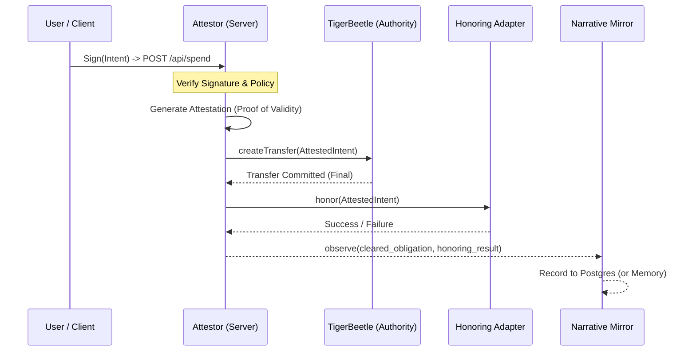

# SOVR Clearing Protocol — VAL Core

<div align="center">
  
</div>

## Sovereign Value Attestation Layer for the GM Family Trust

**VAL Core** is a **ledger-cleared obligation protocol** where value exists only as the result of finalized mechanical transfers. It implements strict sFIAT funding discipline, a mechanically-enforced authority model, and cryptographic integrity monitoring.

This is not a fintech application. It is a protocol for clearing reality itself.

---

## Canonical Authority Model (LOCKED)

The SOVR protocol enforces a non-negotiable authority hierarchy. Truth is mechanical, not narrative.

1.  **TigerBeetle (`val/clearing/tigerbeetle`)** — The **sole mechanical clearing authority**. All obligations are cleared here first, or they do not exist. Its state is immutable and final.

2.  **Backend (`val/core`)** — The **authority gateway**. Orchestrates the clearing flow but holds no authority itself. Translates user intent into ledger commands.

3.  **Honoring Adapters (`val/adapters`)** — **Downstream guests**. Optional external agents (Stripe, Instacart, etc.) that may act upon _already cleared_ obligations. They have no authority to approve, deny, or reverse clearing.

4.  **Narrative Mirror (`val/core/narrative-mirror-service.ts`)** — A **read-only observer**. It records the results of cleared transactions for auditing and human-readable logs. It has zero authority and is never consulted for balance checks or clearing decisions.

---

## Execution Flow (Enforced)

The protocol mandates a "clearing-before-honoring" execution sequence. This is not a guideline; it is mechanically enforced by the `spendCredit` function.



### Key Guarantees:

- **Cryptographic Integrity:** All intents are signed by the user. All validity is attested by the server.
- **Clearing is Atomic and Final:** The `createTransfer` call to TigerBeetle is the single, authoritative event.
- **Honoring is Non-Authoritative:** Honoring adapters can fail without affecting the ledger's state. Failures create new obligations, never rollbacks.
- **Narrative is Never on the Critical Path:** The narrative mirror is a passive listener. Its failure cannot block clearing.

---

## Technology Stack

- **Frontend**: React 18 + TypeScript + Vite + ethers.js (Client Signing)
- **Backend**: Node.js + Express + tsx + ethers.js (Attestation)
- **Clearing Authority**: TigerBeetle (Native Binary on Port 3000)
- **Narrative Mirror**: PostgreSQL (Port 5433)
- **Infrastructure**: Docker Compose (Postgres only) + Native TigerBeetle

---

## Getting Started

### Prerequisites

- Node.js 18+
- npm or yarn
- Docker & Docker Compose
- TigerBeetle Native Binary (included in `tigerbeetle-main`)

### Installation

```bash
# Clone the repository
git clone https://github.com/sovr-holdings/gm-family-trust-val-core.git
cd gm-family-trust-val-core

# Install dependencies
npm install
```

### Running the System

To run the full stack, you will need **three separate terminals**.

**1. Start the Infrastructure (TigerBeetle + Postgres)**

We use Docker for Postgres and a native binary for TigerBeetle (due to `io_uring` kernel requirements).

```bash
# Terminal 1: Start Postgres (Port 5433)
npm run infra:up

# Terminal 2: Start TigerBeetle (Port 3000)
# Windows:
.\tigerbeetle.exe start --addresses=0.0.0.0:3000 tigerbeetle_data/0_0.tigerbeetle

# Linux/Mac:
./tigerbeetle start --addresses=0.0.0.0:3000 tigerbeetle_data/0_0.tigerbeetle
```

**2. Start the Backend Authority Gateway (Port 3001)**

This service connects to the infrastructure, initializes the ledger accounts, and listens for signed intents.

```bash
# In a new terminal, from the project root
npm run server
```

**3. Start the Frontend Application (Port 5173)**

The command terminal for the GM Family Trust.

```bash
# In a third terminal, from the project root
npm run dev
```

---

## Security Model

1.  **Client-Side Signing**: The Frontend generates an ephemeral "Admin" wallet (or connects to one) to sign every `spend` intent.
2.  **Signature Verification**: The Backend verifies the signature against the known Admin address before processing.
3.  **Attestation**: The Backend issues a secondary "System Attestation" using its own private key to prove the transaction was policy-checked before being sent to the ledger.
4.  **Mechanical Truth**: TigerBeetle rejects any double-spends or invalid transfers at the protocol level.

---

## License

© 2026 SOVR Development Holdings LLC. All rights reserved.
