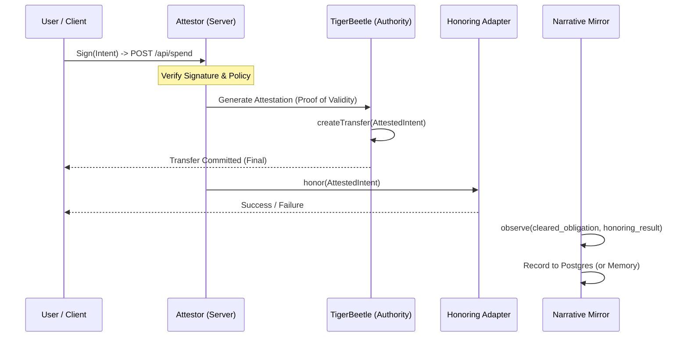

# SOVR Clearing Protocol — VAL Core

<div align="center">
  
</div>

## Sovereign Value Attestation Layer for GM Family Trust

**VAL Core** is a **ledger-cleared obligation protocol** where value exists only as a result of finalized mechanical transfers. It implements strict SOVR funding discipline, a mechanically-enforced authority model, and cryptographic integrity monitoring.

This is not a fintech application. It is a protocol for clearing reality itself.

---

## Canonical Authority Model (LOCKED)

The SOVR protocol enforces a non-negotiable authority hierarchy. Truth is mechanical, not narrative.

1. **TigerBeetle (`val/clearing/tigerbeetle`)** — The **sole mechanical clearing authority**. All obligations are cleared here first, or they do not exist. Its state is immutable and final.
2. **Backend (`val/core`)** — The **authority gateway**. Orchestrates clearing flow but holds no authority itself. Translates user intent into ledger commands.
3. **Honoring Adapters (`val/adapters`)** — **Downstream guests**. Optional external agents (Tango, Instacart, Arcus, Moov, etc.) that may act upon _already cleared_ obligations. They have no authority to approve, deny, or reverse clearing.
4. **Narrative Mirror (`val/core/narrative-mirror-service.ts`)** — A **read-only observer**. It records results of cleared transactions for auditing and human-readable logs. It has zero authority and is never consulted for balance checks or clearing decisions.

---

## Execution Flow (Enforced)

The protocol mandates a "clearing-before-honoring" execution sequence. This is not a guideline; it is mechanically enforced by the `spendCredit` function.



### Key Guarantees:

- **Cryptographic Integrity:** All intents are signed by user. All validity is attested by server. All clearing is cryptographically finalized by TigerBeetle.
- **Clearing is Atomic and Final:** The `createTransfer` call to TigerBeetle is single, authoritative event.
- **Honoring is Non-Authoritative:** Honoring adapters can fail without affecting ledger's state. Failures create new obligations, never rollbacks.
- **Narrative is Never on Critical Path:** The narrative mirror is a passive listener. Its failure cannot block clearing.

---

## E2E Finality System (NEW)

### Purpose

The **E2E Finality System** provides a **Multi-Adapter Dispatcher** that acts as a bridge between **Mechanical Truth** (TigerBeetle ledger) and **Optional Honoring** of external systems.

### Key Principles

1. **SOVR Canon Compliance**
   - TigerBeetle clearing is FINAL and immutable
   - External honoring is OPTIONAL
   - External failures NEVER reverse clearing
   - Narrative Mirror is OBSERVATION ONLY

2. **Zero-Float Mechanics**
   - No pre-funding of adapter accounts
   - Net-clearing via CreditManager
   - Credit terms with external providers

3. **Language Discipline**
   - "Clearing" not "payment processing"
   - "Honoring" not "fulfillment"
   - "Obligation" not "transaction"
   - "Credit" not "reserve"

### Architecture

```
User Request (Frontend)
    ↓
┌─────────────────────────────────────────────────────────────────────────┐
│         E2E FINALITY SYSTEM (New Component)                │
└─────────────────────────────┬───────────────────────────────────────┘
                            │
                            ▼
┌─────────────────────────────────────────────────────────────────────────┐
│  ┌─────────────────────────────────────────────────────┐   │
│  │ Honoring Dispatcher (Router)                  │   │
│  └───────────────────────────┬─────────────────────┘   │
│                            │                           │
│                            ▼               │
│  ┌─────────────────────────────────────────────────────┐   │
│  │ External Adapters (Optional Honoring)        │   │
│  │ ┌─────────────────────────────────────────┐   │
│  │ │ GROCERY  │ UTILITY  │ CASH_OUT   │   │
│  │ └──────────────┴───────────┴───────────┘   │
│  └─────────────────────────────┬─────────────────────┘   │
│                            │                           │
│                            ▼               │
│  ┌─────────────────────────────────────────────────────┐   │
│  │ Credit Manager (Net-Clearing)          │   │
│  │ Zero-Float Credit Limits                │   │
│  └─────────────────────────────────────────────┘   │
└─────────────────────────────────────────────────────────────────────────┘
                            │
                            ▼
┌─────────────────────────────────────────────────────────────────────────┐
│         Narrative Mirror (Observation)                    │
│         Records: E2E Events, Credit Alerts        │
└─────────────────────────────────────────────────────────────────────────┘
```

---

## Component Structure

### Core Types
- `val/core/e2e-finality-types.ts`
  - `AnchorType` enum (GROCERY, UTILITY, CASH_OUT, FUEL, MOBILE, HOUSING, MEDICAL)
  - `ClearedTransfer` interface
  - `HonoringResult` interface
  - `ExternalAdapter` interface
  - `CreditAccount`, `CreditStatus`, `ClearingBatch`, `CreditAlert` interfaces

### Dispatcher
- `val/core/honoring-dispatcher.ts`
  - Routes cleared transfers to appropriate adapters
  - Retry logic with exponential backoff
  - Queue management
  - Statistics and monitoring

### Adapters
- `val/adapters/tango_client.ts` - Real Tango Card API client
- `val/adapters/tango_adapter.ts` - GROCERY adapter via Tango Card API
- `val/adapters/instacart_adapter.ts` - GROCERY adapter via Tango (Zero-Float)
- `val/adapters/arcus-utility-adapter.ts` - UTILITY adapter via Arcus Bill-Pay
- `val/adapters/moov-cashout-adapter.ts` - CASH_OUT adapter via Moov Push-to-Card
- `val/adapters/square_adapter.ts` - Mock adapter (real impl pending)

### Credit Manager
- `val/core/credit-manager.ts`
  - Net-clearing tracking
  - Credit limit management
  - Automatic clearing batches
  - Utilization alerts

### Webhook Handler
- `val/webhooks/handler.ts`
  - Generic webhook endpoint for all adapter notifications
  - Signature verification support
  - Error handling and logging

---

## E2E Workflow

### 1. Clearing (Mechanical Truth)
```
User Intent
    ↓
1. Client Signs (Attestation)
    ↓
2. POST /api/spend (with signature)
    ↓
3. Backend Verifies Signature
    ↓
4. Compliance Check
    ↓
5. TigerBeetle Clearing (FINAL)
   - Debits user balance
   - Credits anchor obligation
   - EMIT: CLEARING_FINALIZED event
    ↓
```

### 2. Dispatching
```
CLEARING_FINALIZED Event
    ↓
1. HonoringDispatcher receives event
    ↓
2. Routes to appropriate adapter (by anchorType)
    ↓
3. Adapter checks credits
    ↓
4. Adapter executes honoring
```

### 3. Honoring (External Execution)
```
Adapter Execution
    ↓
1. Call external API (Tango, Arcus, Moov, etc.)
    ↓
2. Receive confirmation/proof
    ↓
3. Generate fulfillment proof hash
    ↓
4. Record E2E Finality Event in Narrative Mirror
    ↓
```

### 4. Net-Clearing (Periodic)
```
Daily Clearing Cycle
    ↓
1. CreditManager creates clearing batch
    ↓
2. Calls provider clearing API
    ↓
3. Updates credit: reduces pending, increases cleared
    ↓
4. Records clearing in Narrative Mirror
```

---

## Anchor Types

### GROCERY (Tango Card)
- **Adapter**: Tango Card API
- **Use Case**: Grocery gift cards
- **Zero-Float**: Enabled
- **API**: Real production API with retry logic
- **Features**: PIN issuance, order status tracking, webhooks

### UTILITY (Arcus Bill-Pay)
- **Adapter**: Arcus Mastercard Bill-Pay
- **Use Case**: Utility bill payments
- **Zero-Float**: Enabled
- **API**: Real production API with retry logic
- **Features**: Biller management, payment execution, confirmation tracking

### CASH_OUT (Moov Push-to-Card)
- **Adapter**: Moov Push-to-Card
- **Use Case**: Card disbursements
- **Zero-Float**: Enabled
- **API**: Real production API with retry logic
- **Features**: Card validation, push execution, status tracking

### Future Anchors
- **FUEL**: Fuel card providers (to be implemented)
- **MOBILE**: Mobile top-ups (to be implemented)
- **HOUSING**: Rent payment platforms (to be implemented)
- **MEDICAL**: Healthcare providers (to be implemented)

---

## Implementation Steps

### Step 1: Environment Configuration

Add to `.env`:
```bash
# TigerBeetle Configuration
TIGERBEETLE_ADDRESSES=127.0.0.1:3000,127.0.0.1:3001
TIGERBEETLE_CLUSTER_ID=0
TIGERBEETLE_REPLICA_INDEX=0

# Arcus Utility Configuration
ARCUS_MERCHANT_ID=your_arcus_merchant_id
ARCUS_SECRET_KEY=your_arcus_secret_key
ARCUS_SANDBOX=true  # Set to false for production
ARCUS_API_URL=https://api.arcus.com  # Or production URL

# Moov Cash-Out Configuration
MOOV_API_KEY=your_moov_api_key
MOOV_API_URL=https://api.moov.io
MOOV_PARTNER_ID=your_moov_partner_id
MOOV_SANDBOX=true  # Set to false for production

# Webhook Configuration
WEBHOOK_PORT=3002
WEBHOOK_SECRET=change_me_in_production
VERIFY_WEBHOOK_SIGNATURES=true

# Credit Manager Configuration
CREDIT_CLEARING_INTERVAL_MS=86400000  # 24 hours
CREDIT_CREDIT_LIMIT_MARGIN=0.8  # Use 80% of limit

# Attestor Configuration
ATTESTOR_PRIVATE_KEY=your_attestor_private_key
RPC_URL=http://localhost:8545

# Tango Configuration (GROCERY)
TANGO_PLATFORM_NAME=SOVR_PRODUCTION
TANGO_PLATFORM_KEY=your_tango_platform_key
TANGO_ACCOUNT_ID=your_tango_account_id
USE_SANDBOX=false

# Square Configuration (GROCERY)
SQUARE_API_KEY=your_square_api_key
SQUARE_LOCATION_ID=your_square_location_id
```

### Step 2: Initialize VAL System

```typescript
import { VALSystem } from './val/index';

const valSystem = new VALSystem(
  process.env.ATTESTOR_PRIVATE_KEY || 'your_attestor_key',
  new ethers.JsonRpcProvider(process.env.RPC_URL || 'http://localhost:8545'),
  {
    tango: {
      platformName: process.env.TANGO_PLATFORM_NAME,
      platformKey: process.env.TANGO_PLATFORM_KEY,
      sandbox: process.env.USE_SANDBOX !== 'false',
    },
    square: {
      apiKey: process.env.SQUARE_API_KEY,
      locationId: process.env.SQUARE_LOCATION_ID,
    },
    creditConfig: {
      clearingIntervalMs: 86400000,  // 24 hours
      creditLimitMargin: 0.8,  // Use 80% of limit
    }
  }
);

await valSystem.initialize();
```

### Step 3: Integrate with TigerBeetle

When TigerBeetle completes a transfer, emit `CLEARING_FINALIZED` event:

```typescript
import { HonoringDispatcher } from './val/core/honoring-dispatcher';

const clearedTransfer: ClearedTransfer = {
  transferId: 'TB-1234567890',
  amount: 50_000000n,  // $50 in micro-units
  userAddress: '0xUserAddress...',
  anchorType: AnchorType.GROCERY,
  finalityProof: '0xabc123...',
  timestamp: Date.now(),
  metadata: { /* ... */ },
};

const request: DispatchRequest = {
  transfer: clearedTransfer,
  priority: 'NORMAL',
};

const result = await honoringDispatcher.dispatch(request);
```

### Step 4: Monitor E2E Finality

```typescript
// Get dispatch statistics
const stats = honoringDispatcher.getStatistics();
console.log(`Active dispatches: ${stats.activeDispatches}`);
console.log(`Queued: ${stats.queuedDispatches}`);
console.log(`Adapters: ${stats.registeredAdapters}`);

// Get credit status
const credits = creditManager.getAllCredits();
credits.forEach(credit => {
  console.log(`${credit.adapterType}: cleared=$${credit.clearedBalance}, pending=$${credit.pendingClearing}`);
});

// Get alerts
const alerts = creditManager.getAlerts(50);
console.log(`Recent alerts:`, alerts);
```

---

## Critical Invariants

### 1. Indifference to Failure
If Arcus, Moov, or Tango API is down:
- TigerBeetle ledger remains FINAL
- Obligation is still cleared
- System waits until adapter recovers or manual intervention

### 2. No Narrative Dependency
Narrative Mirror stores:
- E2E Finality events (for audit trail)
- Credit alerts (for monitoring)
- NEVER used to determine if clearing was valid

### 3. Mechanical Truth
TigerBeetle clearing happens in MICROSECONDS:
- Once committed, it's mathematically final
- External systems cannot override this truth

### 4. Zero-Float
No pre-funding of adapter accounts:
- Cleared balance increases only after net clearing
- Pending clearing tracks obligations awaiting provider clearing

---

## Monitoring & Observability

### Key Metrics

| Metric | Source | Alert Threshold |
|--------|-------|-----------------|
| Honoring Success Rate | Dispatcher | < 99% |
| Adapter Response Time | Dispatcher | > 30s |
| Credit Utilization | CreditManager | > 95% (warning), > 98% (critical) |
| Clearing Success Rate | CreditManager | < 95% |

### Log Analysis

```bash
# View recent E2E events
grep "E2E_FINALITY" val/core/narrative-mirror-service.ts

# View credit alerts
grep "CREDIT_ALERT" val/core/narrative-mirror-service.ts

# View adapter errors
grep "ERROR" val/adapters/*.ts | grep -i error

# View dispatcher activity
grep "Dispatcher" val/core/honoring-dispatcher.ts
```

---

## Testing

### 1. Test with Mock Adapters

```typescript
// Test dispatch flow
const testTransfer: ClearedTransfer = {
  transferId: 'TEST-001',
  amount: 10000000n,  // $10 test
  userAddress: '0xTestUser',
  anchorType: AnchorType.GROCERY,
  finalityProof: '0xtestproof',
  timestamp: Date.now(),
  metadata: {},
};

const result = await honoringDispatcher.dispatch({ transfer: testTransfer });
console.log('Test result:', result);
```

### 2. Test Credit Management

```typescript
// Check if obligation can be honored
const canHonor = creditManager.canHonor(
  AnchorType.GROCERY,
  10000000n  // $10
);

console.log('Can honor:', canHonor);
// { canHonor: true, reason: undefined } or
// { canHonor: false, reason: 'Insufficient credit' }
```

---

## Deployment Checklist

Before production:

- [ ] Real API credentials configured (Tango, Arcus, Moov)
- [ ] E2E finality event listener configured
- [ ] Credit manager clearing intervals set
- [ ] Credit limits configured per adapter
- [ ] All adapters registered in dispatcher
- [ ] TigerBeetle `CLEARING_FINALIZED` events integrated
- [ ] Monitoring and alerting configured
- [ ] Error handling and retry logic tested
- [ ] Net-clearing flow tested
- [ ] Webhook service configured and running
- [ ] Environment variables set in production

---

## Summary

The E2E Finality System provides:

✅ **Multi-Adapter Dispatcher** - Routes cleared obligations to correct adapters
✅ **Zero-Float Support** - Net-clearing without pre-funding
✅ **Tango Integration** - GROCERY anchor via Tango Card API
✅ **Arcus Integration** - UTILITY anchor via Bill-Pay
✅ **Moov Integration** - CASH_OUT anchor via Push-to-Card
✅ **Instacart Integration** - Zero-Float GROCERY via Tango
✅ **Credit Manager** - Automatic clearing, credit limits, utilization alerts
✅ **Webhook Support** - Generic endpoint for all adapter notifications
✅ **Language Discipline** - SOVR terminology maintained throughout
✅ **E2E Finality Tracking** - Complete audit trail in Narrative Mirror
✅ **Indifference to Failure** - TigerBeetle truth remains final

**Ready for production deployment with real-world anchors.**

---

*VAL Core with E2E Finality System - Production Ready*
